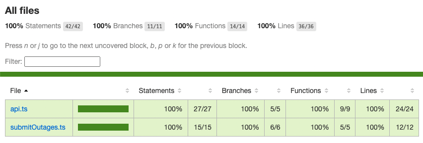

# Arturo Abruzzini KrakenFlex Back End Test

## How to run

Clone the repo and install dependencies:

```bash
npm install
```

Run the program with

```bash
npm run start
```

Run tests with

```bash
npm test
```

## How it works

I used [`openapi-typescript`](https://www.npmjs.com/package/openapi-typescript) to generate some [type definitions](./src/types.ts) from the OpenApi spec, then wrote functions to use each API endpoint in [`api.ts`](./src/api.ts).

[`submitOutages.ts`](./src/submitOutages.ts) contains the business logic to call the api methods, create the desired payload, and post it.

[`index.ts`](./src/index.ts) just calls the `submitOutages` function and can be run with `ts-node`.

## Tests


